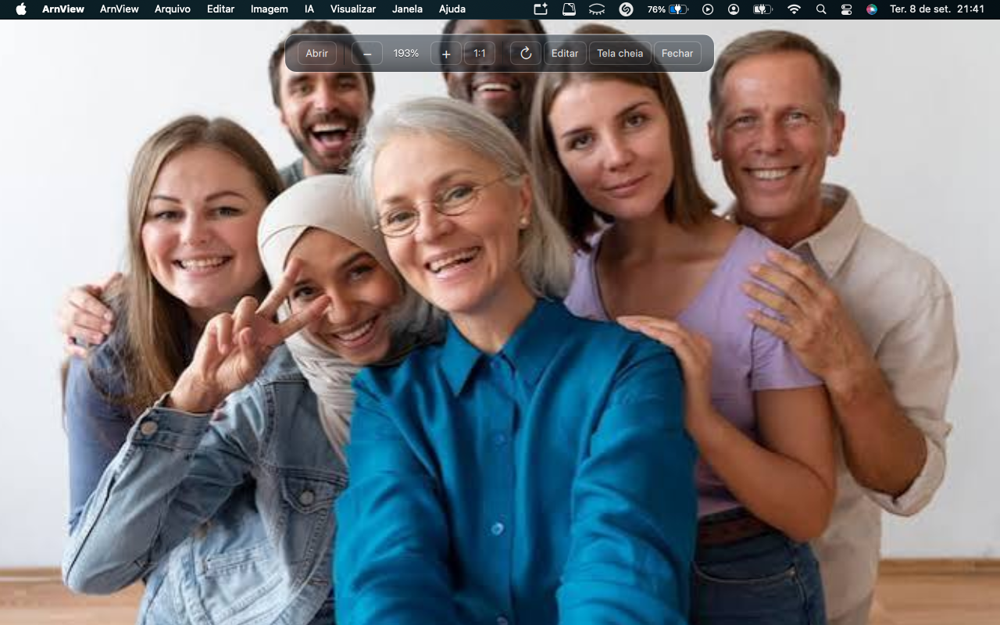
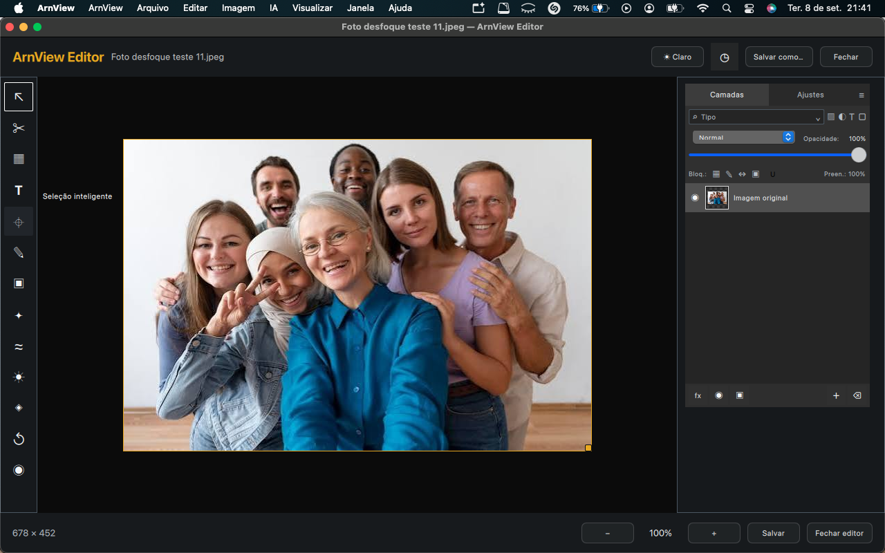

# ArnView

**ArnView** é um visualizador e editor de imagens para macOS Intel desenvolvido por **Alessandro Henriques Teixeira — Studio Arn**.

O projeto combina visualização rápida, edição por camadas e ferramentas inteligentes no mesmo ambiente. A linha atual é proprietária: o repositório mantém públicas as informações de versão, recursos, créditos e distribuição, enquanto o código-fonte das versões proprietárias não é publicado.

## ArnView 0.7.9 — versão nativa, leve e integrada

A versão **0.7.9** representa uma mudança importante na arquitetura do ArnView. O objetivo foi reduzir dependências pesadas e aproximar o processamento dos recursos nativos do macOS, preservando dentro do aplicativo as ferramentas de edição e inteligência artificial.

O resultado é uma edição muito mais enxuta em relação às primeiras implementações baseadas em ambientes Python e grandes conjuntos de bibliotecas. Sempre que possível, o ArnView 0.7.9 utiliza **Core ML, Apple Vision e motores nativos compilados para Intel x86_64**.

Mesmo com a redução de peso, o aplicativo mantém seus mecanismos e modelos necessários integrados ao pacote. Isso permite que grande parte das ferramentas inteligentes seja executada localmente, sem depender de serviços de IA na nuvem.

### Visualizador

- visualização rápida de imagens;
- navegação entre imagens da mesma pasta;
- faixa de miniaturas;
- **zoom de até 3200%**;
- zoom por scroll e trackpad;
- visualização 1:1;
- rotação e tela cheia;
- abertura pelo Finder, seletor e arrastar e soltar;
- acesso direto ao editor a partir da imagem visualizada.

### Editor e camadas

- interface **ArnGlass**;
- editor integrado ao visualizador;
- sistema de múltiplas camadas;
- seleção e manipulação direta das camadas na área de edição;
- movimentação, redimensionamento e reorganização de camadas;
- transparência e opacidade;
- histórico de alterações, desfazer e refazer;
- ajustes contínuos de brilho, contraste, saturação, temperatura e matiz;
- preto e branco e sépia;
- recorte;
- texto sobre a imagem;
- escolha completa de cores para texto, contorno e sombra;
- sombra de texto com visualização em tempo real;
- rotação de texto diretamente com o mouse;
- pincel de desfoque;
- copiar, recortar e colar seleções em novas camadas.

### Ferramentas inteligentes integradas

O ArnView 0.7.9 concentra as ferramentas inteligentes na barra lateral do editor e utiliza mecanismos locais/nativos sempre que possível.

- **Remover fundo** — processamento integrado com MODNet/Core ML e auxiliares nativos de visão;
- **Remover objeto** — preenchimento inteligente com LaMa/Core ML integrado;
- **Seleção inteligente** — Apple Vision para identificação de primeiro plano e assuntos compatíveis;
- **Seleção por clique** — MobileSAM/Core ML para seleção interativa de objetos;
- **Melhoria inteligente automática**;
- **Redução de ruído**;
- **Clareamento/recuperação de fotos escuras**;
- **Restauração fotográfica**;
- **Melhoria de rostos**;
- **remoção/redução de desfoque** com mecanismo nativo;
- detectores nativos de pessoas e primeiro plano;
- processamento e composição integrados ao sistema de camadas.

### Arquitetura nativa e leveza

A linha 0.7.9 reduz a dependência de ambientes externos e concentra o processamento no próprio aplicativo. Entre os componentes empregados estão:

- **Apple Core ML** para execução local de modelos;
- **Apple Vision** para segmentação e análise visual;
- **LaMa/Core ML** para remoção de objetos;
- **MODNet/Core ML** para remoção de fundo, especialmente em pessoas;
- **MobileSAM/Core ML** para seleção inteligente por clique;
- motores auxiliares nativos compilados para macOS Intel.

A prioridade desta versão é entregar um aplicativo mais compacto e responsivo sem transformar os recursos de IA em serviços externos. Os modelos necessários às funções distribuídas são incorporados ao pacote do ArnView.

## Capturas de tela — ArnView 0.7.9

### Visualizador ArnGlass

A interface principal mantém o foco total na imagem, com controles compactos e transparentes sobre o conteúdo.

### ArnView Editor

O editor reúne ferramentas de seleção, texto, edição e inteligência artificial na barra lateral, mantendo o painel de Camadas e Ajustes compacto à direita.

## Privacidade e processamento local

As ferramentas que utilizam os mecanismos integrados processam a imagem no próprio computador. Isso reduz a necessidade de enviar fotografias para serviços externos e permite que essas funções trabalhem localmente/offline.

## Compatibilidade

- **Versão:** ArnView 0.7.9;
- **plataforma:** macOS Intel;
- **arquitetura:** x86_64;
- desenvolvido e testado na linha Intel do macOS utilizada durante o desenvolvimento;
- Apple Silicon e Windows exigem builds próprios e não fazem parte desta distribuição Intel.

## Distribuição

A versão proprietária é distribuída como aplicativo compilado. O código-fonte público histórico do repositório não representa o código da linha 0.7.9.

O pacote oficial da versão é identificado como **ArnView-0.7.9-Intel.dmg**.

> A distribuição atual pode não possuir Apple Developer ID/notarização. Nesse caso, o macOS poderá apresentar o aviso de desenvolvedor não identificado na primeira abertura.

## Licenciamento

- o conteúdo e código anteriormente publicados permanecem sujeitos aos termos existentes quando foram disponibilizados;
- **ArnView 0.6.x, 0.7.x e versões proprietárias posteriores:** código-fonte não disponibilizado publicamente;
- todos os direitos sobre os elementos originais do ArnView permanecem reservados ao autor;
- frameworks, modelos e demais componentes de terceiros continuam sujeitos às licenças de seus respectivos autores.

## Autoria

- **Produto:** ArnView
- **Criador e desenvolvedor:** **Alessandro Henriques Teixeira**
- **Estúdio:** **Studio Arn**
- **Ano:** 2026

Copyright © 2026 **Alessandro Henriques Teixeira — Studio Arn**. Todos os direitos reservados sobre os elementos originais do ArnView, observadas as licenças aplicáveis aos componentes de terceiros.

Consulte também `CHANGELOG.md`, `CREDITS.md`, `THIRD_PARTY_NOTICES.md`, `PROPRIETARY-NOTICE.md` e `LICENSE`.
