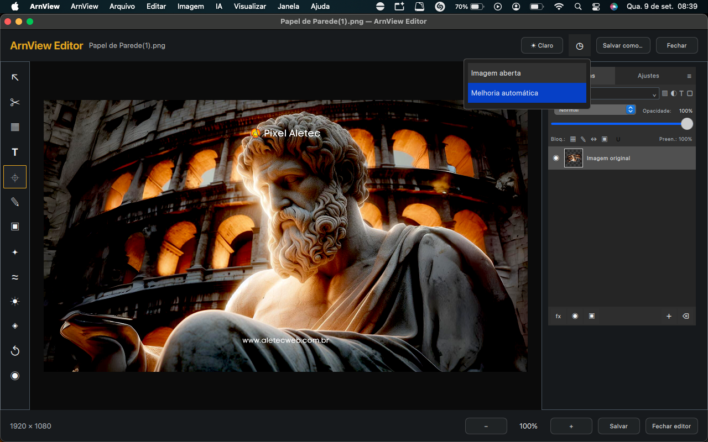
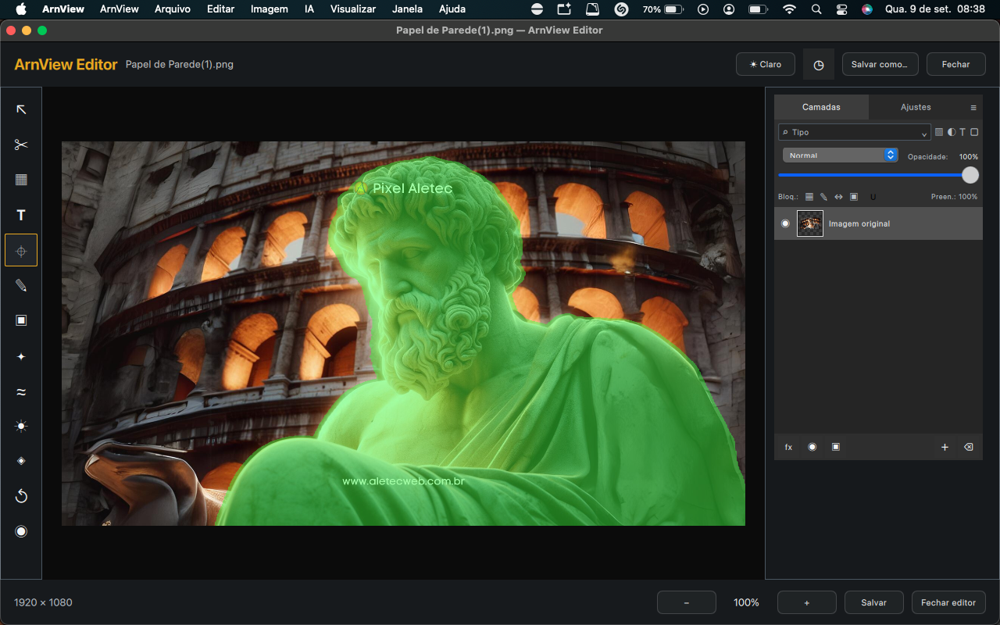
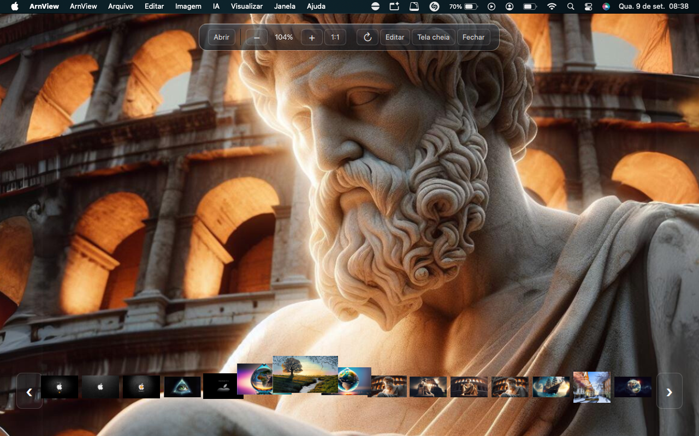

# ArnView

**ArnView** é um visualizador e editor de imagens para macOS Intel desenvolvido por **Alessandro Henriques Teixeira — Studio Arn**.

> **ArnView 0.7.9 é software proprietário.** Este repositório público existe para apresentação do produto, documentação, notas de versão, créditos, capturas de tela e distribuição dos binários autorizados. O código-fonte da linha proprietária não é publicado na branch principal.

## Versão atual

**ArnView 0.7.9 — Native & Lightweight Edition — macOS Intel**

- Plataforma: macOS
- Arquitetura: Intel **x86_64**
- Distribuição: binário proprietário
- Pacote oficial: `ArnView-0.7.9-Intel.dmg`
- Tamanho do DMG publicado: **234.959.692 bytes**
- SHA-256: `a9a0927c61eb56d496bfe2f362beb860265f04b81330b8dccc7de893bd7e6c52`

[Baixar ArnView 0.7.9 no GitHub Releases](https://github.com/AleSulista/ArnView/releases/tag/v0.7.9)

## O que é o ArnView

O ArnView reúne em um único aplicativo:

- visualizador rápido de imagens;
- editor integrado;
- sistema de múltiplas camadas;
- ferramentas de texto, ajustes, seleção e composição;
- recursos inteligentes executados localmente sempre que aplicável;
- integração com mecanismos nativos do macOS, Apple Vision e Core ML.

## Visualizador

- navegação entre imagens da mesma pasta;
- faixa de miniaturas;
- zoom por scroll e trackpad;
- zoom de até **3200%**;
- visualização 1:1;
- rotação;
- tela cheia;
- abertura pelo Finder, seletor de arquivos e arrastar e soltar;
- acesso direto ao editor.

## Editor e camadas

- interface ArnGlass;
- múltiplas camadas;
- seleção e manipulação direta na área de edição;
- movimentação, redimensionamento e reorganização de camadas;
- transparência e opacidade;
- histórico de alterações;
- desfazer e refazer;
- brilho, contraste, saturação, temperatura e matiz;
- preto e branco e sépia;
- recorte;
- pincel de desfoque;
- copiar, recortar e colar seleções;
- texto com escolha completa de cores;
- contorno e sombra;
- visualização de sombra em tempo real;
- rotação de texto diretamente com o mouse.

## Ferramentas inteligentes integradas

A versão 0.7.9 concentra os recursos inteligentes no próprio fluxo de edição e privilegia processamento local.

- **Remover fundo** — MODNet/Core ML e mecanismos auxiliares nativos;
- **Remover objeto** — LaMa/Core ML;
- **Seleção inteligente** — Apple Vision;
- **Seleção por clique** — MobileSAM/Core ML;
- melhoria automática;
- redução de ruído;
- recuperação de fotos escuras;
- restauração fotográfica;
- melhoria de rostos;
- redução de desfoque com mecanismo nativo;
- detecção nativa de pessoas e primeiro plano.

## Arquitetura 0.7.9

A linha 0.7.9 foi reorganizada para reduzir dependências externas e aproximar o processamento dos frameworks nativos do macOS. O pacote final distribui seus frameworks, motores e modelos necessários dentro do aplicativo, sem exigir instalação do Homebrew para executar a versão publicada.

Entre as tecnologias empregadas na distribuição estão:

- Apple Core ML;
- Apple Vision;
- Qt 6;
- MODNet;
- LaMa;
- MobileSAM;
- motores auxiliares nativos compilados para Intel x86_64.

Os componentes de terceiros permanecem sujeitos às licenças de seus respectivos autores e projetos.

## Capturas de tela — ArnView 0.7.9

### Visualizador ArnGlass

Interface principal com foco na imagem, controles compactos, navegação por miniaturas, zoom, rotação e tela cheia.

### Editor e seleção inteligente

Editor integrado com ferramentas de seleção, camadas, ajustes e processamento visual.

### Melhoria automática

Ferramentas inteligentes integradas ao histórico de edição, incluindo melhoria automática, redução de ruído, restauração e outros recursos locais.

### Camadas, composição e remoção de fundo

Sistema de camadas com movimentação, redimensionamento, composição de imagens, seleção e remoção inteligente de fundo.

## Privacidade e processamento local

Os mecanismos integrados de edição e visão computacional da versão 0.7.9 foram projetados para processar as imagens localmente no computador sempre que aplicável, reduzindo a necessidade de enviar arquivos para serviços externos.

Consulte [`PRIVACY.md`](PRIVACY.md) para o resumo público de privacidade do produto.

## Repositório público e código-fonte

A branch principal deste repositório é destinada à **distribuição e documentação pública** do ArnView proprietário. O código-fonte atual da linha 0.7.x não é publicado.

Materiais presentes em commits históricos podem pertencer a fases anteriores do projeto e permanecem sujeitos aos termos que se aplicavam quando foram publicados. A existência desses registros históricos não concede direitos sobre o código proprietário atual.

## Licenciamento

ArnView 0.7.9 é distribuído sob licença proprietária. A disponibilização do binário não concede autorização para copiar, modificar, sublicenciar, vender, redistribuir ou explorar comercialmente os elementos originais do ArnView fora das condições expressamente autorizadas pelo titular.

Frameworks, modelos, bibliotecas e demais componentes de terceiros não são relicenciados pelo Studio Arn e permanecem sujeitos às respectivas licenças.

Consulte:

- [`LICENSE`](LICENSE)
- [`PROPRIETARY-NOTICE.md`](PROPRIETARY-NOTICE.md)
- [`THIRD_PARTY_NOTICES.md`](THIRD_PARTY_NOTICES.md)
- [`CREDITS.md`](CREDITS.md)
- [`CHANGELOG.md`](CHANGELOG.md)
- [`RELEASE-NOTES-0.7.9.md`](RELEASE-NOTES-0.7.9.md)
- [`SUPPORT.md`](SUPPORT.md)

## Autoria

**ArnView — criado e desenvolvido por Alessandro Henriques Teixeira — Studio Arn.**

Copyright © 2026 **Alessandro Henriques Teixeira — Studio Arn**. Todos os direitos reservados sobre os elementos originais do ArnView, observadas as licenças aplicáveis aos componentes de terceiros.
