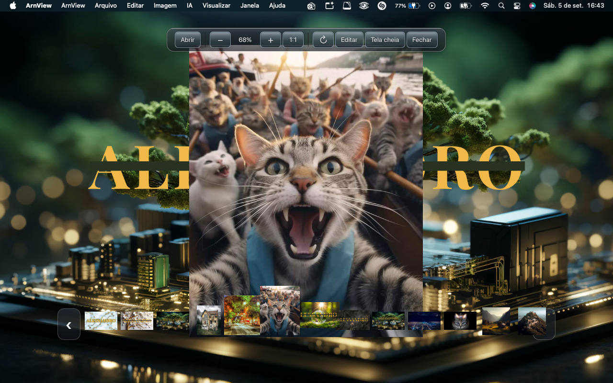
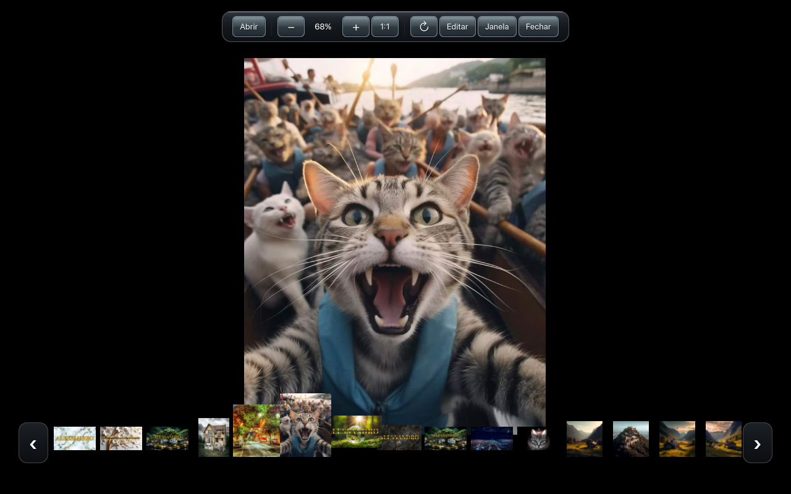
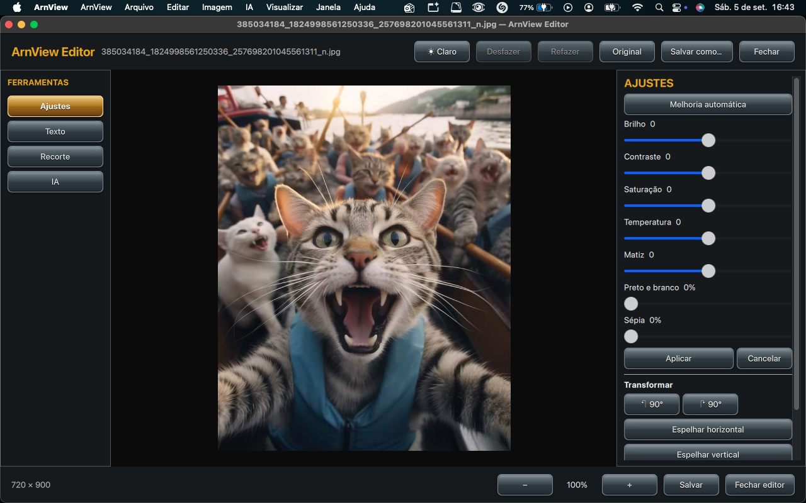
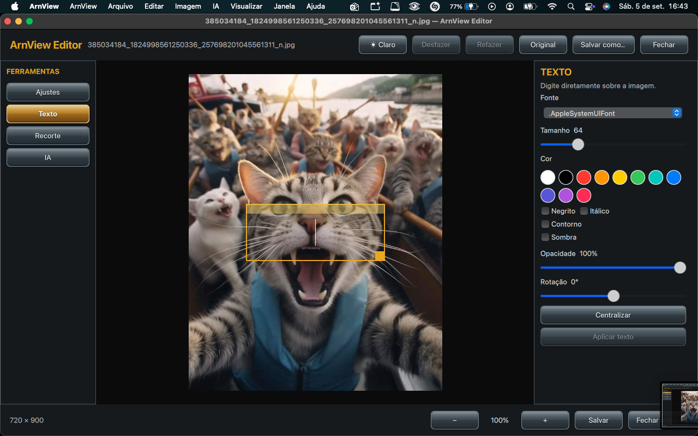
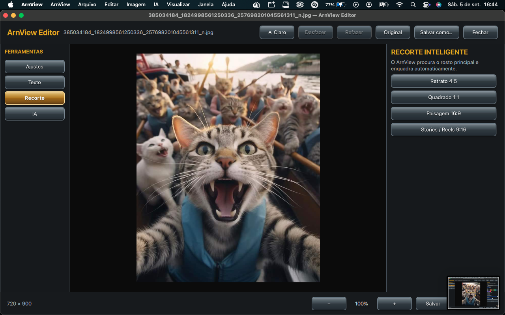
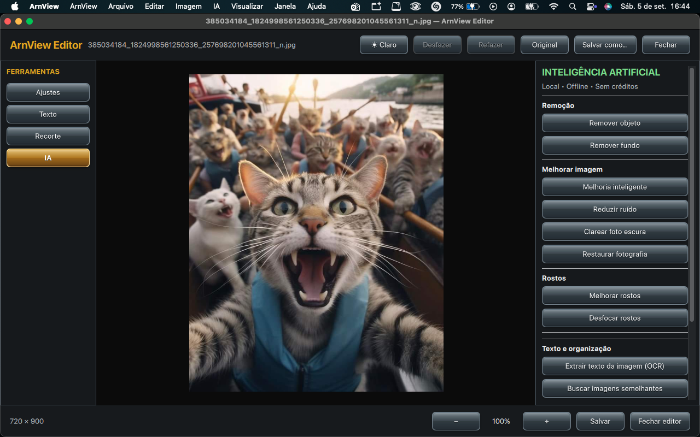

# ArnView

**ArnView** é um visualizador e editor de imagens para macOS Intel desenvolvido por **Alessandro Henriques Teixeira — Studio Arn**.

## Situação atual do projeto

A linha pública deste repositório corresponde ao **ArnView 0.4.0**. A partir da linha **0.6.x**, o ArnView passa a seguir um modelo **proprietário**: as informações de versão, melhorias e recursos continuam públicas, mas o código-fonte da nova linha não será publicado neste repositório.

O **ArnView 0.6.0 Proprietário** está em preparação para distribuição em macOS Intel.

## ArnView 0.6.0 — principais mudanças e melhorias

A versão 0.6.0 representa uma evolução importante do visualizador e editor, com foco em edição por camadas, interface mais limpa e recursos de inteligência artificial executados localmente.

### Interface e edição

- nova interface visual **ArnGlass**;
- painel de camadas redesenhado e mais próximo do fluxo de editores profissionais;
- seleção e manipulação de camadas diretamente na área principal de edição;
- movimentação, redimensionamento e organização visual das camadas;
- reorganização da ordem das camadas;
- controles inferiores do painel de camadas mais compactos;
- transparência/opacidade de camadas aprimorada;
- histórico de alterações com identificação das operações realizadas;
- manutenção do fluxo de desfazer e refazer;
- ajustes de imagem com resposta mais fluida.

### Inteligência artificial local

- **remoção de objetos com LaMa**, executada localmente;
- remoção inteligente e automática de fundo;
- processamento de pessoas com **MODNet/Core ML**;
- segmentação de cenas e objetos com tecnologias nativas do macOS, incluindo **Apple Vision Foreground**;
- detectores e auxiliares nativos para pessoas, rostos, primeiro plano e outras operações de visão computacional;
- processamento local, sem necessidade de enviar a imagem para um serviço externo nas funções suportadas offline.

### Recursos já presentes na linha ArnView

- visualização rápida de imagens;
- navegação entre imagens da mesma pasta;
- miniaturas;
- zoom por scroll e trackpad;
- ajuste automático à tela e visualização 1:1;
- rotação e tela cheia;
- abertura pelo Finder, seletor e arrastar e soltar;
- editor integrado;
- brilho, contraste, saturação, temperatura e matiz;
- preto e branco, sépia e melhoria automática;
- texto sobre a imagem com controles de estilo;
- recorte em proporções comuns;
- redução de ruído;
- recuperação de fotos escuras;
- restauração fotográfica;
- melhoria de rostos;
- aumento de resolução;
- OCR;
- recursos de busca e análise visual.

## Capturas de tela da versão pública 0.4.0

As imagens abaixo documentam a versão pública anterior. As capturas da interface 0.6.0 serão publicadas separadamente quando a nova distribuição estiver finalizada.

### ArnView Viewer

### Visualização limpa

### Editor — Ajustes

### Editor — Texto

### Editor — Recorte inteligente

### Editor — Inteligência Artificial local

## IA local e tamanho do aplicativo

O ArnView foi projetado para que seus principais recursos de inteligência artificial funcionem **localmente e offline**. A distribuição completa pode ser maior que a de um visualizador convencional porque inclui modelos, frameworks, bibliotecas e mecanismos necessários para o processamento no próprio computador.

Entre as tecnologias utilizadas ao longo do projeto estão LaMa, MODNet, Core ML, Apple Vision, OpenCV, Real-ESRGAN, Tesseract OCR, NumPy, Pillow, Python embarcado e Qt 6. Componentes de terceiros permanecem sujeitos às licenças e aos direitos de seus respectivos autores.

## Privacidade

Os recursos locais são processados no próprio computador sempre que a função correspondente utiliza o mecanismo offline integrado. Isso permite realizar grande parte da edição e do processamento de IA sem enviar as imagens do usuário a um serviço externo.

## Licenciamento

- **ArnView 0.4.0 e conteúdo anteriormente publicado:** permanecem sujeitos aos termos e avisos existentes na versão em que foram disponibilizados.
- **ArnView 0.6.x e versões proprietárias posteriores:** código-fonte não disponibilizado publicamente; todos os direitos sobre os elementos originais reservados ao autor, sem prejuízo das licenças aplicáveis aos componentes de terceiros.

A mudança de modelo de distribuição não altera as licenças dos projetos, frameworks, modelos ou bibliotecas de terceiros incorporados ou utilizados pelo ArnView.

## Autoria

- **Produto:** ArnView
- **Criador e desenvolvedor:** **Alessandro Henriques Teixeira**
- **Estúdio:** **Studio Arn**
- **Plataforma principal desta linha:** macOS Intel

Copyright © 2026 **Alessandro Henriques Teixeira — Studio Arn**. Todos os direitos reservados sobre os elementos originais do ArnView, observadas as licenças aplicáveis aos componentes de terceiros.

Consulte também [`CHANGELOG.md`](CHANGELOG.md), `LICENSE` e `CREDITS.md`.
